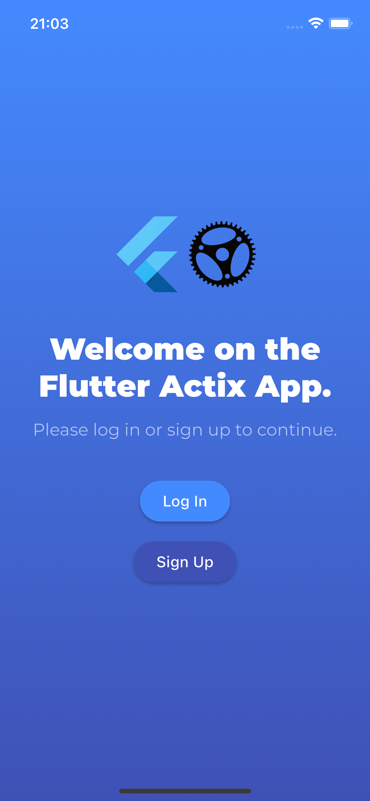
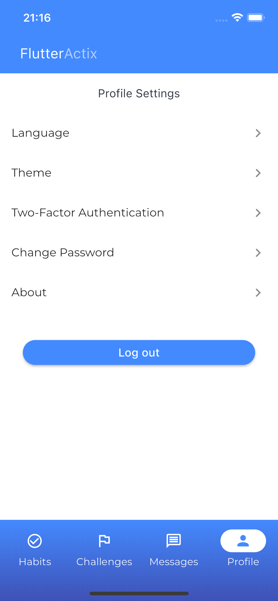
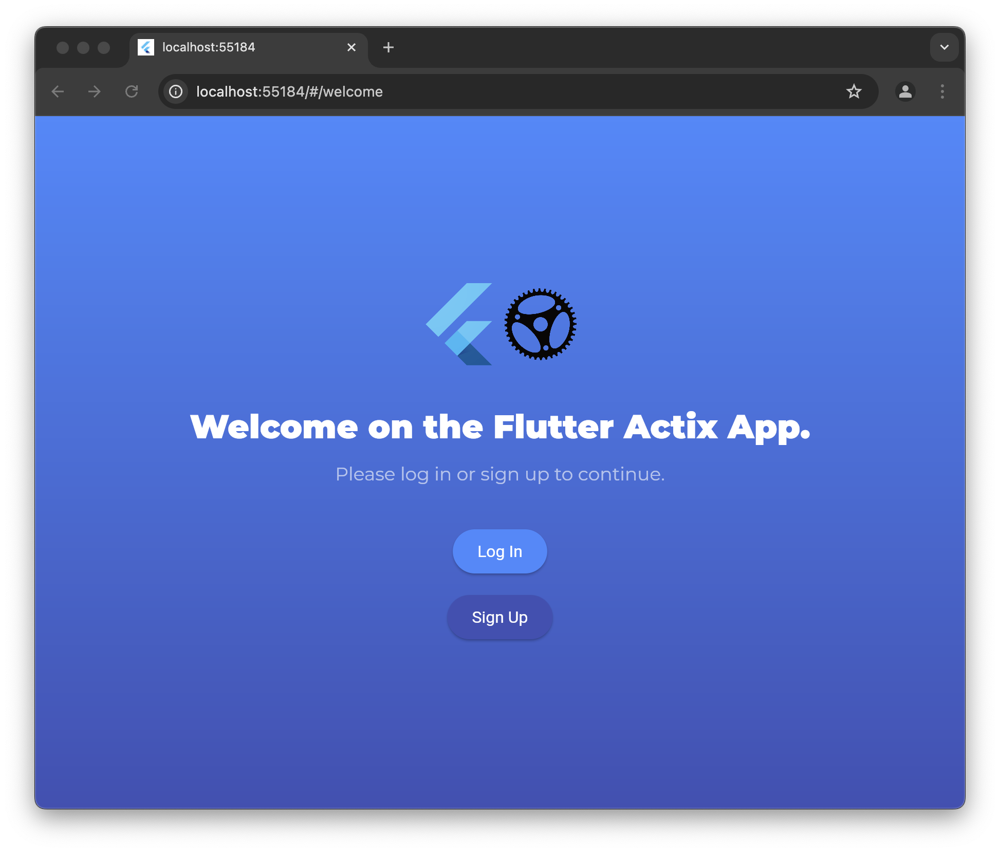
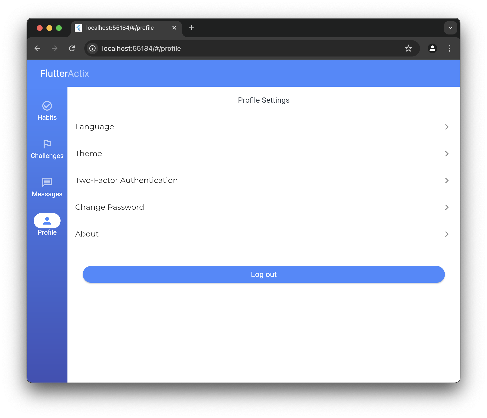

# Flutter Actix App

This project is an application starter pack. The stack used is:

- Front: Flutter, Bloc, go_router, get_it
- Back: Actix Web, sqlx, jsonwebtoken, argon2, secrecy, totp-rs
- DB: Postgres
- Docker: One container for front, one for back, one for DB

Features done:

- signup / login using username / password
- logout
- two factor authentication with one-time passwords
- account recovery using recovery codes and 2FA/password
- theme selection (light, dark)
- language selection (english, french)
- password update
- "about" page
- access and refresh tokens stored in secure locations
- 3 empty tabs ready to be implemented
- 1 profile tabs ready to be continued
- snackbar displaying translated error / success / info messages

## Context

I plan to develop a real app, but it will take a lot of time, and due to personal reasons, there are chances it will never be released. I don't want to spoil here what this app will be about, but you can find some hints in this project. Before starting this app, I wanted to create a starter template to share my discoveries with people who learn these technologies.

I tried implementing clean architecture, but do not consider me an expert, I have always worked on small projects that didn't require it.

The frontend has no tests (feel free to add some!).
The backend has 45 tests covering most of the code.

## Demo

[](https://youtu.be/ZCqYWs-lrRM)

## Screenshots






## Installation and development

### Docker images

To pull the right flutter image: https://github.com/cirruslabs/docker-images-flutter/pkgs/container/flutter

For mac:
docker pull ghcr.io/cirruslabs/flutter:3.24.0-0.2.pre@sha256:8e6ae5d10c653665cbe5f5737e23eb9ef50eaa6d2a0b90d834226db1352fa007

### Backend commands

#### To be able to use sqlx cli tools

```bash
cargo install sqlx-cli --no-default-features --features postgres
```

#### To create a new migration file

```bash
sqlx migrate add name_of_your_migration
sqlx migrate run
```

### Run locally on an external device

Change every occurrence of 192.168. somewhere in the code to match your IP.

Create frontend/.env on the model of frontend/.env.template changing the variable to match your situation (API_BASE_URL for instance).

### Run on Android :

Make sure to follow the section ## Run locally on an external device first.

Turn on Developer Options and USB debugging “File sharing”.

Developer Options > Select USB Configuration > Change it from “File Transfer” (default option) to Charging”.

The phone will ask if you want to always allow USB debugging from this device.

Say yes.

Install android-studio from their web page.

Create a fake project.

From android-studio, Settings -> SDK Manager -> Languages & Frameworks -> Android SDK -> SDK Tools

Check Android SDK Command-line tools box.

Click Apply.

To check everything is fine: flutter doctor --verbose

To build the apk: flutter build apk --flavor dev --release

To install on device: flutter install --flavor dev

## Sources of inspiration

Install localizations on ios: https://medium.com/@gauravswarankar/internationalizing-flutter-apps-a2b82e804ca6
Flutter, blocs, clean architecture: https://github.com/Yoga3911/flutter_bloc_clean_architecture/tree/master
Flutter, themes, clean architecture: https://github.com/hungps/flutter_pokedex

## And now?

Feel free to create issues, pull requests, and ask me anything about this project. It's not guaranteed that I will keep working on this, but who knows?
